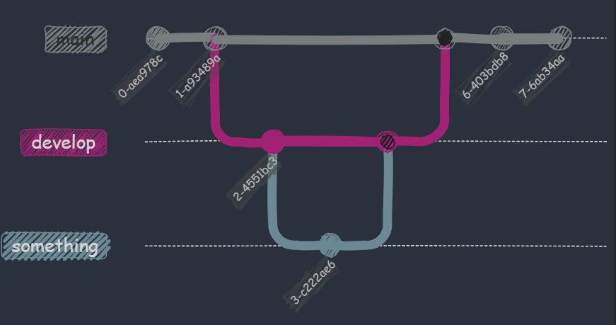

## What is Git?

* A version control system (VCS)
* Tracks changes in files over time
* Allows multiple people to collaborate on a project
* Enables you to revert to previous versions if needed

---

## Understanding Branches

* A branch is a separate line of development
* Create a branch to work on a new feature without affecting the main codebase
* Multiple branches can exist simultaneously

---

## Understanding Branches



---

## Creating and Switching Branches

```bash
git branch <branch_name>  # Create a new branch
git checkout <branch_name> # Switch to an existing branch
```

### Alternate way

```bash
git switch <branch_name>
```

---

## Merging Branches

* Combine changes from one branch into another
* Use `git merge <branch_name>` to merge
* Resolves conflicts if necessary

---

## Common Branching Strategies

* **Git Flow:** Strict rules for feature, release, and hotfix branches
* **GitHub Flow:** Simpler, based on pull requests
* **Trunk-Based Development:** All work happens on the main branch

---

## Best Practices

* Keep branches up-to-date with the main branch
* Use descriptive branch names
* Review code before merging
* Use pull requests for code collaboration
* Consider using a branching model that fits your team's needs

---

## Demo Time!
* Live coding demonstration of creating, switching, and merging branches
* Showcasing conflict resolution

---

Thanks


